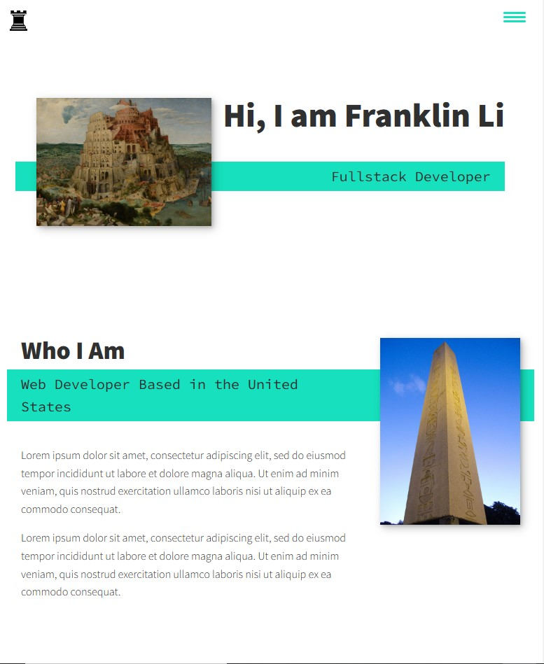

# Coding Portfolio

## Description 

A basic portfolio showcasing usage of CSS mechanics with links in the nav bar going to different sections of the website and a sample of previously done porjects with links to them.

## Website Link

## Website Preview

## Usage

In the top right corner of the screen, there is a nav bar that will take ou to different sections of the webpage.

In the 'My Recent Projects' section, clicking on the images will take you to different websites linked to the images.

At the bottom of the website, it has my contact info and my social media links.

## Credits

Thank you to Kevin Powell at [Scrimba](https://scrimba.com/learn/portfolio) and [freeCodeCamp.org](https://www.freecodecamp.org/news/build-and-deploy-your-own-personal-portfolio-site/) for making [this video](https://www.youtube.com/watch?v=_xkSvufmjEs) that helped me get through most of the coding work.

Powell, K. (n.d.). Build your web developer portfolio - free tutorial course. Scrimba. Retrieved April 9, 2023, from https://scrimba.com/learn/portfolio 

## Liscenses

Please refer to the LICENSE in the repo.

